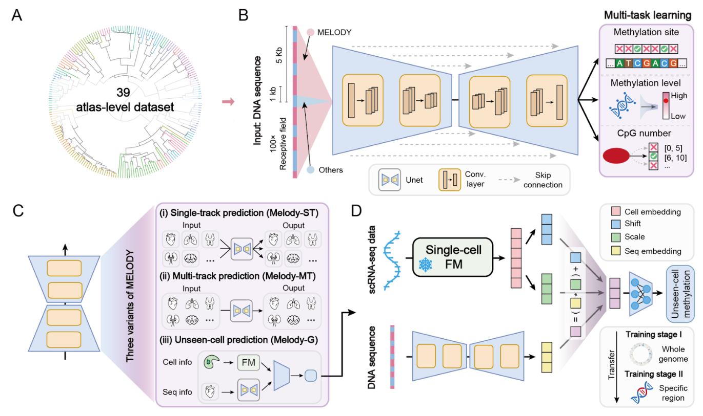

# Melody: Decoding the Sequence Determinants of Locus-Specific DNA Methylation Across Human Tissues



This repository contains the official implementation of Melody, a deep learning framework designed to decipher the DNA sequence determinants underlying human DNA methylation landscapes. Melody accurately predicts cell-type-specific methylation profiles and generalizes to unseen cell types via scRNA-seq integration.

The peer-reviewed article is available in [Nature Communications](https://doi.org/10.1038/s41467-026-76744-5).
The published Source Data workbook is included at `supplemental_data/supplemental_data.xlsx`,
and figure-reproduction code is maintained in the
[Melody_manuscript repository](https://github.com/FakeEnd/Melody_manuscript).


## 🔍 Overview


Melody leverages a specialized U-Net architecture with a large receptive field (10kb) to capture long-range genomic dependencies. It supports:

1. **Locus-Specific Prediction:** Accurate methylation level prediction at single-CpG resolution.
2. **Multi-Task Learning:** Simultaneously predicts methylation levels, CpG counts, and regional averages.
3. **Cross-Modal Generalization:** Predicts methylation for **unseen cell types** using scRNA-seq foundation models (Melody-G).


## 🧩 Framework Variants


The code supports three variants of the model:

- **Melody-ST (Single-Track):** Specialized for a single cell type.
- **Melody-MT (Multi-Track):** Jointly models methylation across multiple tissues (e.g., 39 cell types).
- **Melody-G (Generalize):** Integrating scRNA-seq embeddings to predict methylation in unseen cell types.


## 🛠️ Installation

We recommend using Anaconda or Miniconda for environment management.

### 1. Create Environment

```bash
conda create -n melody python=3.10
conda activate melody
```

### 2. Install PyTorch

Choose the command that matches your CUDA version (check with `nvidia-smi`).

*For CUDA 11.8:*

```bash
pip install torch torchvision torchaudio --index-url https://download.pytorch.org/whl/cu118
```

*For newer CUDA versions:*

```bash
pip install torch torchvision torchaudio
```

### 3. Install Dependencies

```bash
# Core libraries
pip install transformers einops ninja seaborn loguru echo_logger
pip install scikit-learn tensorboard matplotlib jupyter tqdm pandas accelerate fire
conda install zlib

# Genomics & Visualization tools
pip install h5py h5sparse pyBigWig tensorboardX medpy pytabix pyfaidx wandb plotly liftover
pip install selene-sdk

# Clean up
pip cache purge
```

*Note: You may need to install `cupy-cuda11x` or `cupy-cuda12x` depending on your driver version if required by specific sub-dependencies.*

## 📂 Data Preparation

Please download the necessary dataset (Reference Genome `hg38`, processed BigWigs, and Checkpoints) from our Google Drive.

**[📥 Download Data (Google Drive)](https://drive.google.com/drive/folders/1O1OZ_w-3X97MM47XSmgc_165n2dJ1KND?usp=sharing)**

Organize the downloaded files into a `data/` directory in the project root:

```
Melody/
├── data/
│   ├── fasta/
│   │   └── Homo_sapiens.GRCh38.dna.primary_assembly.fa
│   ├── bigwigs/
│   │   ├── GSM5652317_Blood-B-Z000000UB.hg38.bigwig
│   │   ├── ... (other cell types)
│   └── checkpoints/
├── examples/                 # tiny example inputs + expected output (shipped)
├── predict.py                # inference entry point
├── run.py                    # training entry point
└── ...
```

### What you provide vs. what Melody ships

A frequent question is *which files the user supplies and which are part of the
software*. The table below makes this explicit.

| File | Provided by | Needed for | Notes |
|------|-------------|-----------|-------|
| GRCh38 FASTA (`Homo_sapiens.GRCh38.dna.primary_assembly.fa`) | **Software** (download once from Google Drive) | Training; inference from genomic coordinates | You do **not** create this. |
| Trained checkpoint (`*.pth`) | **Software** (download from Google Drive) | Inference; fine-tuning | Defines the cell types the model predicts. |
| Processed BigWigs (`*.bigwig`) | **Software** (download from Google Drive) | **Training only** (they are the targets) | **Not needed for inference.** |
| **A list of genomic regions** (BED: `chrom start end`, GRCh38) | **You (the user)** | Inference Mode A | Predict methylation at sites of interest in the genome. |
| **Your own DNA sequences** (FASTA) | **You (the user)** | Inference Mode B | Predict methylation for designed / synthetic / variant sequences. |

In short: to **predict methylation on your own data you only supply a BED file of
GRCh38 regions, or a FASTA of your own sequences.** Everything else (genome,
weights) is downloaded with the software.


## 🔮 Inference: Predict Methylation for Your Own Data

Use `predict.py` to run a trained model. It outputs the predicted methylation
level (0–1) at every CpG, for each requested cell type. Two input modes:

**Mode A — predict for genomic regions (you provide GRCh38 coordinates):**

```bash
python predict.py \
  --checkpoint data/checkpoints/Melody-MT-39.pth \
  --regions    examples/example_regions.bed \
  --output     my_predictions.csv
# Optional: restrict to specific cell types (exact or substring match)
#   --cell-types Blood-B,Adipocytes,Cortex-Neuron
```

The DNA sequence for each region is fetched automatically from the bundled
GRCh38 FASTA (`--genome`, default `data/fasta/...`). Output columns:
`chrom, cpg_pos, cell_type, methylation`.

**Mode B — predict for your own sequences (no genome needed):**

```bash
python predict.py \
  --checkpoint data/checkpoints/Melody-MT-39.pth \
  --input-fasta examples/example_sequences.fa \
  --output      my_seq_predictions.csv
```

Each FASTA record is center-cropped/padded to the model window (10 kb). Output
columns: `seq_id, cpg_pos, cell_type, methylation` (`cpg_pos` is relative to your
input sequence).

**Single-track (Melody-ST) checkpoints:** add `--n-track 1` (and optionally
`--track-names YourCellType`). The default `--n-track 39` matches the released
multi-tissue Melody-MT model.

A worked example with expected output is provided in
[`examples/`](examples/) (`example_regions.bed`, `example_sequences.fa`, and
`example_predictions_regions.csv`). Run `python predict.py --help` for the full
list of options.


## 🚀 Usage (Training)

The main training script is `run.py`. It automatically switches between **Melody-ST** and **Melody-MT** modes based on the number of BigWig files provided.

### Training Melody-ST & Melody-MT

1. Melody-ST (Single Track)

Train on a specific cell type (e.g., Blood-B).

```bash
python run.py \
  --lab_name "Melody_ST_Blood" \
  --bigwigs_files "GSM5652317_Blood-B-Z000000UB.hg38.bigwig" \
  --gpu 0 \
  --window_size 10000 \
  --batch_size 32 \
  --lr 0.001
```

2. Melody-MT (Multi Track)

Train jointly on multiple cell types. Simply provide multiple files or use a directory scan logic if implemented in your custom wrapper.

```bash
python run.py \
  --lab_name "Melody_MT_All" \
  --bigwigs_files "file1.bigwig" "file2.bigwig" ... \
  --use_cg_loss \
  --use_avg_loss \
  --gpu 0
```


### Training Melody-G

Melody-G involves a two-stage training process located in subdirectories:

- **Stage 1 (G1):** Pre-training on whole chromosomes.

  ```bash
  cd melodyG1
  python run.py --lab_name "Melody_G1_Pretrain" ...
  ```

- **Stage 2 (G2):** Fine-tuning on cell-type-specific regions.

  ```bash
  cd melodyG2
  python run.py --one_stage_ckpt "../path/to/stage1.ckpt" ...
  ```


### Key Arguments

| **Argument**                   | **Default** | **Description**                                     |
|--------------------------------|-------------|-----------------------------------------------------|
| `--window_size`                | 10000       | Input DNA sequence length (Receptive field).        |
| `--bigwigs_files`              | ...         | List of target BigWig files for training.           |
| `--any_cpg_focal_weight`       | 8.0         | Weight for any CpG sites.                           |
| `--low_methy_cpg_focal_weight` | 32.0        | Weight for low-methylation sites                    |
| `--use_cg_loss`                | False       | Enable auxiliary CpG count prediction loss.         |
| `--use_avg_loss`               | False       | Enable auxiliary regional average methylation loss. |


## 📊 Monitoring

This project uses [WandB](https://www.google.com/search?q=https://wandb.ai/) for logging. Ensure you are logged in:

```bash
wandb login
```

Training logs (Loss, LR, etc.) will be synced to your WandB project defined by `--project` (Default: "Melody").


## 🖊️ Citation

If you find this work useful for your research, please cite our paper:

```
@article{Jin2026Melody,
  title={Decoding the sequence determinants of locus-specific DNA methylation across human tissues},
  author={Jin, Junru and Wang, Ding and Qiao, Jianbo and Gao, Wenjia and Liu, Yuhang and Chen, Siqi and Zou, Quan and Wu, Shu and Su, Ran and Wei, Leyi},
  journal={Nature Communications},
  year={2026},
  doi={10.1038/s41467-026-76744-5},
  url={https://doi.org/10.1038/s41467-026-76744-5}
}
```


## 📧 Contact

For any questions, please open an issue or contact the authors.
